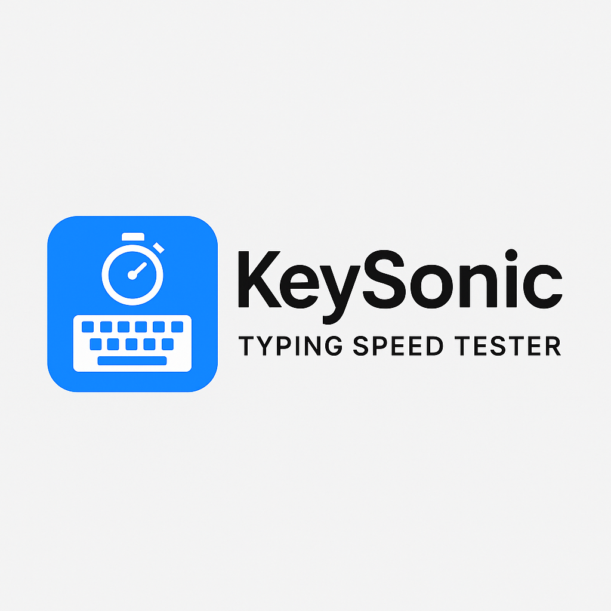

# KeySonic
KeySonic is a fast, interactive typing speed tester with live WPM, accuracy, emoji feedback, and custom timer options. Choose between sentence or paragraph mode. Clean UI, animated background, result tracking, and modern design for all typing practice needs.
# ⌨️ KeySonic – Typing Speed Tester

KeySonic is a lightweight, modern typing speed tester web app with real-time feedback, emoji-based encouragement, and customizable test modes.

## 🚀 Features

- 🔹 Paragraph or Sentence typing mode
- ⏱️ Custom time setting (15s, 30s, 60s, or user-defined)
- 💬 Real-time WPM and Accuracy
- 😊 Live animated emoji feedback based on performance
- 🌌 Starfield animated background
- 📊 Results page with time taken, time left, total time, WPM, and accuracy
- 🔒 Copy-protection for displayed text

## 📁 Folder Structure

keysonic/
├── index.html
├── style/
│ ├── style.css
│ └── result-style.css
├── script/
│ └── main.js
├── data/
│ └── texts.json
├── results/
│ └── result.html
├── assets/
│ └── logo.png

## 🌐 Demo

Try it live on: [https://your-username.github.io/keysonic/](https://your-username.github.io/keysonic/)

## 🛠️ How to Run

1. Clone or download the repository
2. Open `index.html` in any modern browser
3. No backend or server setup required

## 📦 Deploy

Easily deploy using GitHub Pages, Netlify, or Vercel.

## 📄 License

MIT – free to use, modify, and share.
